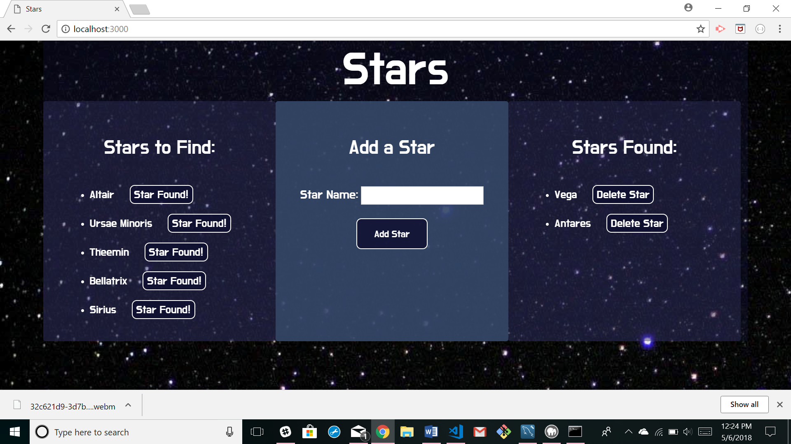

# Stars
This project was created by Jaime Halupka as a requirement for homework during University of Central Florida's Coding Bootcamp. 

### Screenshots

### Description

In this desktop app, the user can enter a new star to be found. Once entered, it appears on the left side of the screen with a button marked 'Star Found'. Once the user has found the star, they press this button and the star moves to the right side of the screen, under 'Stars Found.' Once on the right side of the screen, there is the option to delete each star from the database.

### Link to Application

[Heroku Link](https://safe-bastion-85550.herokuapp.com/)

### GIFs

[GIF Link](https://gfycat.com/gifs/detail/NecessaryEarlyAvocet)

### Node Packages Used

* express
* body-parser
* express-handlebars
* mysql
